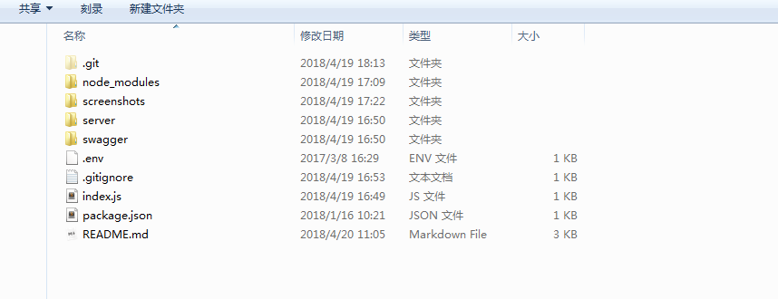

### 说明

本项目是个人博客搭建项目之一，本来打算放在一个项目里的，但是放在一个项目里代码会比较乱，所以分开多个项目来管理。关于整个博客项目的搭建以及介绍可以参考我的这篇博文。


本项目为后端接口及文档项目，其他项目地址：

[博客前端项目](https://github.com/keenjaan/blog)

[博客后台管理页面](https://github.com/keenjaan/blog-admin)

这三个项目完成了整个博客的构建，剩下的就是服务端部署，由于之前没有接触过服务端部署，所以什么东西都是现学，把服务器部署整个过程记录下来了。关于服务端配置仅供参考因为我也是新手。

[node项目部署——阿里云centos部署ftp](https://www.jianshu.com/p/7258a75798c4)

[node项目部署——阿里云cento部署node和nginx](https://www.jianshu.com/p/7aad651bdbb4)

[node项目部署——阿里云centos部署git服务](https://www.jianshu.com/p/d7713fbd3e5d)

[node项目部署——阿里云centos部署mongodb](https://www.jianshu.com/p/b5fd46aaec43)

项目已在服务器上正常跑起来了。


#### 使用说明

该项目为个人博客的api接口部分，包含后端接口部分和接口文档部分。后端接口使用的是express + mongolass，接口文档使用的是swagger-ui。

运行本项目除了clone该项目的代码安装依赖外，还要在本地电脑安装mongodb，并且成功启动mongodb服务。本项目才能正常启动。

关于mongodb安装网上很多教程，自己去google，在window上装mongodb有很多坑，装完最好注册成服务。

```bash
## 克隆项目
git clone git@github.com:keenjaan/blog-api.git

## 安装依赖
cd blog-api
npm install

## 全局安装supervisor
npm install supervisor -g // 可以实时监听本地文件改变重启服务，便于调试。

## 运行项目
supervisor index.js
```

本项目后端设置了允许跨域，方便本地跑前端项目时，当然你也可以用webpack插件实现代理来访问。我的项目已经做好了文档编写，你在本地成功运行我的代码后可以在浏览器里输入 127.0.0.1:3089，即可看到hello word字样，输入127.0.0.1:3089/swagger即可看到接口文档。你可以通过前端后台管理项目直接添加数据，在此接口文档就可以查看接口调用的结果。


#### 接口文档编写

> 准备：下载swagger-ui和swagger-edit。：

swagger-ui 地址：[传送门](https://github.com/swagger-api/swagger-ui)

swagger-edit 地址：[传送门](https://github.com/swagger-api/swagger-editor/releases/download/v2.10.4/swagger-editor.zip)，当然也可以直接到官网去编辑，但是官网可能打不开哦，就需要下载到本地运行编辑器编辑。


**本地运行swagger-editor**


1、启动swagger-editor：

在本项目下执行http-server swagger-editor -p8989。在浏览器中打开localhost:8989即可打开swagger-editor。

**注意：要全局安装http-server。默认端口号为8080。**


2、编辑swagger-editor：

在editor中编辑代码，左边是编辑区，右边是视觉效果。编辑好后导出json文件。关于文档的编写这里不展开讲解，可以参考这篇文章[传送门](https://zhuanlan.zhihu.com/p/21353795)，文章写得很详细。


3、部署接口文档：

在项目根目录下新建swagger文件夹，将下载的swagger-ui文件中dist目录下的所有文件复制到public文件夹下。将2步骤导出的json文件也放入swagger文件夹下。修改swagger下index.html文件中 url = "http://petstore.swagger.io/v2/swagger.json"，将其改为swagger.json。在index.js中加上静态模块：

```
app.use('/swagger', express.static('./swagger'));
```

用node启动index.js，如果端口号为3000，在浏览器中打开 http://localhost:3000/swagger即可查看接口文档。


**接口文档连接服务器，实时获取接口数据：**

swagger.json中有个host字段，要想接口文档能调通地址，需此host地址与浏览器中请求的地址一模一样。本地开服务ip可以是：

1、本机内网ip地址：如192.168.0.217:3000 (你本机的ip地址),

2、本机本地服务地址：127.0.0.1:3000,

3、本机本地服务简写：localhost:3000


**本项目结构：**




#### 接口文档截图


